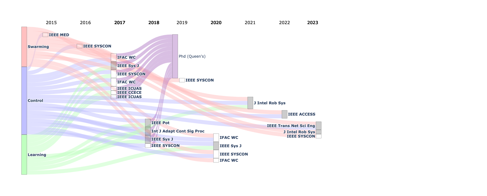

# Sankey chart for publication record

This program produces a sankey chart for an academic publication record by 
date and discipline. Data needs to be input manually, but future versions
will automatically pull from Google Scholar.

## Example


  
