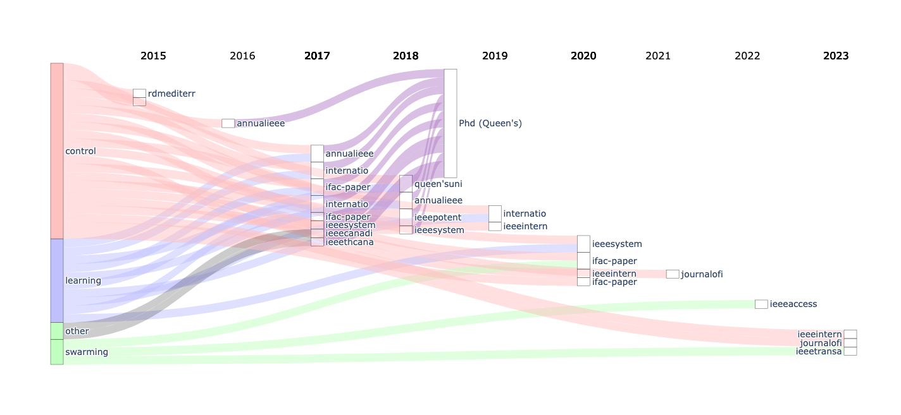

# Sankey chart for your Google Scholar profile

This program produces a Sankey chart for academic publication records by 
date, discipline, and degree completion. 
It automatically pulls the data from Google Scholar using
the [scholarly API](https://github.com/scholarly-python-package/scholarly) .

The publications are automatically categorized by discipline based on a 
keyword search of the title and journal/conference name. For now, only keywords
for control, learning, and swarming are provided.

## Plans for improvement

- expand scope of keywords 
- find a better way to truncate the publication titles

## Example

Below is an example for scholar 'Peter Travis Jardine':


  
